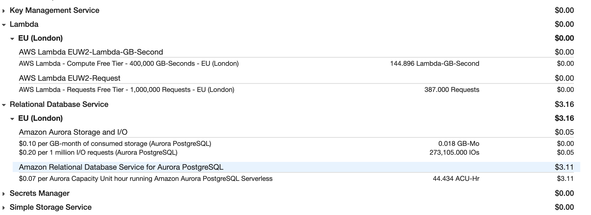

# Code Challenge




The easy way to review would be following [Development Section](#development)
and read the [Code Review Section](#code-review)

## Code Review

[Endpoint exposed](./systems/backend/schema.graphql)

[Frontend code related to feature](./systems/frontend/src/GameLibraryPage)

[Backend code related to feature](./systems/backend/src/game-gallery)

[Infrastructure setup](./systems/infrastructure/src/index.ts)

[Architecture decision record](./docs/adr)
P.S. some of ADR document I circle back after finish coding, so it may out of order.

## Development

```sh
npm install
npx lerna bootstrap
npx lerna exec --stream \
--scope '{backend,frontend}' -- bash scripts/dev-setup.sh
npx lerna exec --stream \
--scope '{backend,frontend}' -- bash scripts/dev-server.sh

Open http://localhost:3000 for dev
```
