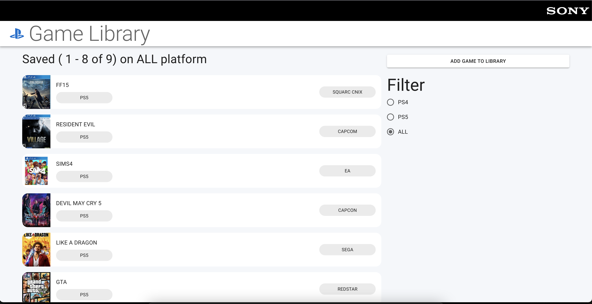

# Code Challenge



[Example Deployment in cloud front](https://d16m8sgb6n5atc.cloudfront.net/)

The easy way to review would be following [Development Section](#development)
and read the [Code Review Section](#code-review)

## Code Review

[Endpoint exposed](./systems/backend/schema.graphql)

[Frontend code related to feature](./systems/frontend/src/GameLibraryPage)

[Backend code related to feature](./systems/backend/src/game-gallery)

[Infrastructure setup](./systems/infrastructure/src/index.ts)

[Architecture decision record](./docs/adr)
P.S. some of ADR document I circle back after finish coding, so it may out of order.

## Development

```sh
npm install
npx lerna bootstrap
npx lerna exec --stream \
--scope '{backend,frontend}' -- bash scripts/dev-setup.sh
npx lerna exec --stream \
--scope '{backend,frontend}' -- bash scripts/dev-server.sh

Open http://localhost:3000 for dev
```

## Missing features / Improvement points

- More test

Current only graphql endpoint
and add game form have been tested

- Consistent form field implementation

When I integrate react-hook-form
i not always use `useController`,
some input I will use `Controller` HOC that make reader feel very confusing

- Share more code between backend and frontend

Especially some
enum value and type definition

- Spinner when call API

When call API on frontend ,
I haven't include loading screen

- More Form error handling ?

Not all input field on add game form
have implement validation rules

- S3 bucket CORS too open

I allowed any origin to put object to S3 bucket
because pulumi don't have option to update resource
after created.

- ColdStart will take a while to load

That will invoke a some apps size optimization and UI handling ,
it out of scope of this challenge
