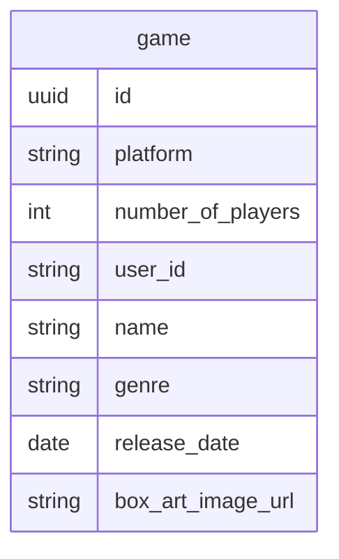

# Database structure for code

- Status: accepted
- Date: 2022-03-22

## Context and Problem Statement

I want design database table for holding game library of user.

## Decision Drivers

- Time to development
- Flexible on extends
- Actual requirement

## Considered Options

- have User, UserGames, Game three table
- place userId on Game table

## Decision Outcome

- place userId on Game table

because I only have limited time and
migration afterward seem not impossible

