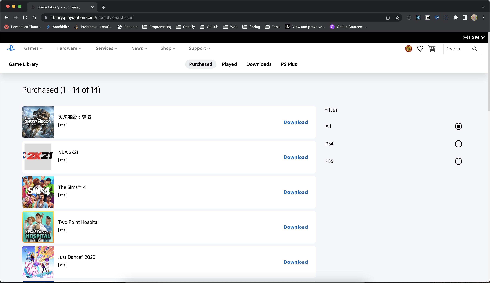
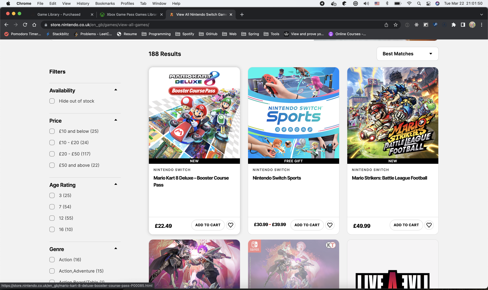

# Page UX design

- Status: [proposed | rejected | accepted | deprecated | … | superseded]
- Date: 2022-03-22

## Context and Problem Statement

I go to implement the feature on frontend and need some research 
on how people in world doing.

## Decision Drivers 

- Implementation complexity
- Make sense to user

## Considered Options

- [PS Store](https://library.playstation.com/recently-purchased)

For XBox and Nintendo I don't have account to visit bought game list. 
so let check the console game list here.    

- [XBox](https://www.xbox.com/en-gb/xbox-game-pass/games?xr=shellnav)

- [Nintendo](https://store.nintendo.co.uk/en_gb/games/view-all-games/)

## Decision Outcome

Because PSN is much clean and easily to implement, let go on that

